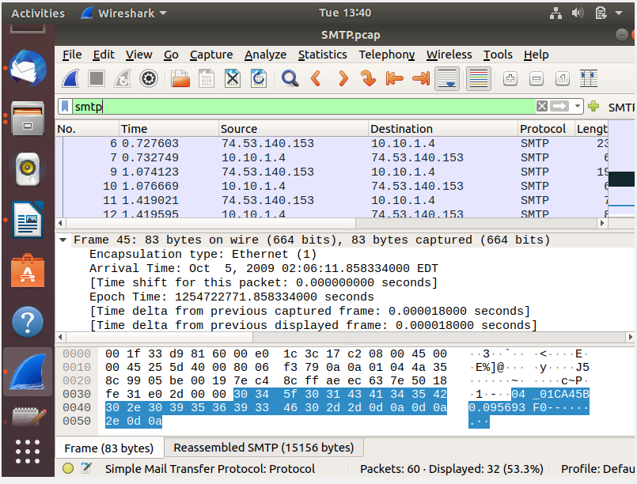
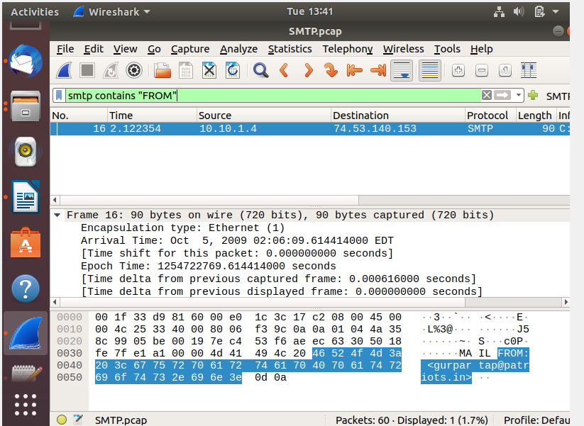
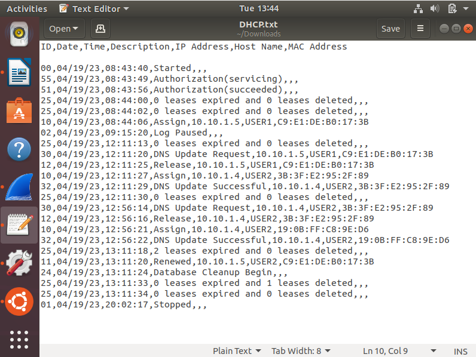
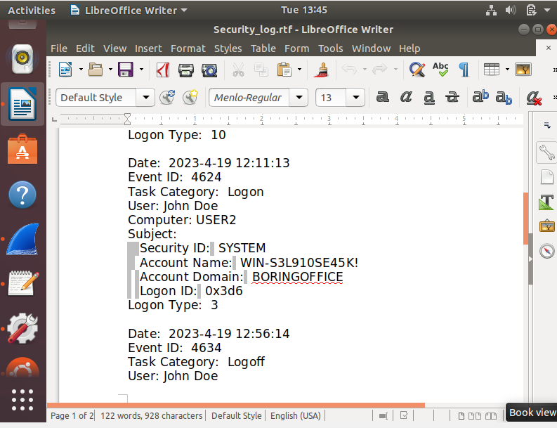

# Network Forensics Investigation

## Overview

In this project, I investigated suspicious email activity to find out where it came from and identify the user connected to it.

I used Wireshark to analyze the network traffic, checked DHCP logs to match the IP address to a device, and then reviewed security logs to find out which user was logged into that device at the time.

## Tools Used

* Wireshark
* SMTP
* DHCP logs
* Security logs
* Ubuntu/Linux

## Investigation Process

### 1. Analyze Network Traffic

I opened the packet capture in Wireshark and used display filters to narrow down the traffic to SMTP packets related to the email activity.

### 2. Identify the Source IP Address

After filtering the traffic, I looked through the relevant SMTP packet and identified the source IP address connected to the suspicious activity.

### 3. Match the IP Address to a Device

I reviewed the DHCP logs and matched the source IP address to the device that had been assigned that IP address at the time.

### 4. Review the Security Logs

Once I identified the device, I checked the security logs to find out which user was logged into the system during the incident.

## Skills Demonstrated

* Network traffic analysis
* Packet capture analysis
* Wireshark filtering
* SMTP analysis
* IP address attribution
* DHCP log analysis
* Security log analysis
* Log correlation
* Incident investigation
* Network forensics

## What I Learned

This project helped me understand how different logs can work together during an investigation. Wireshark helped me identify the IP address, the DHCP logs helped me connect that IP address to a device, and the security logs helped me identify the user.

It also showed me why looking at only one source of information may not be enough when investigating suspicious activity.
