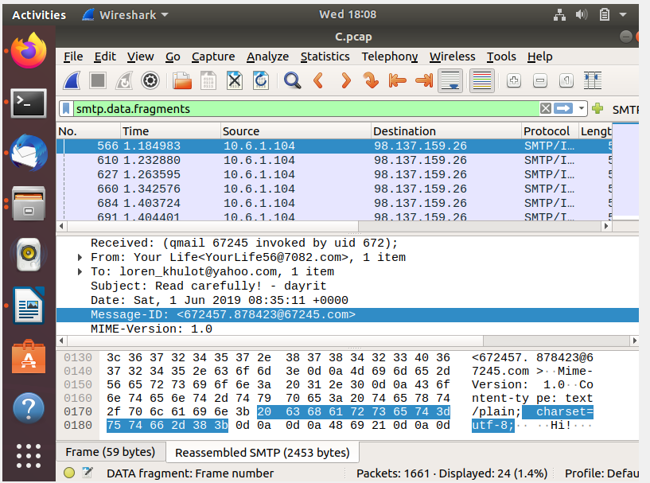
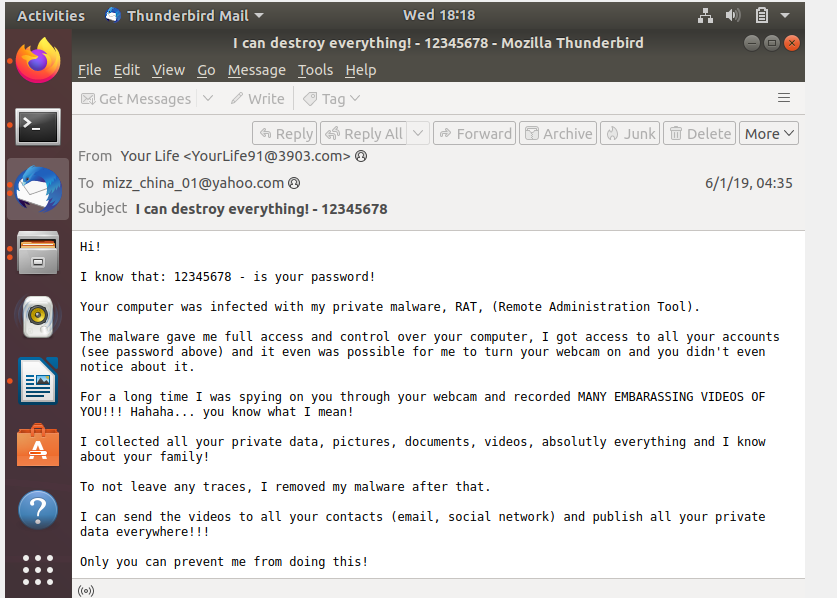
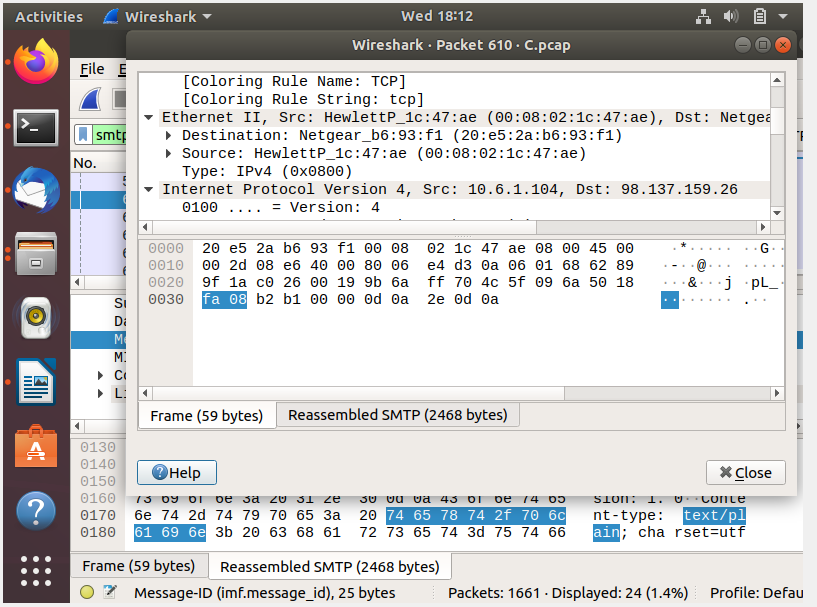

# Phishing Email Investigation

## Overview

In this project, I analyzed several PCAP files in Wireshark to identify phishing emails and trace where the suspicious activity came from.

I reviewed SMTP traffic, used filters to narrow down the email data, looked at the subject lines and message content, and then checked the network information connected to the emails.

## Tools Used

* Wireshark
* PCAP files
* SMTP
* Ubuntu/Linux
* Thunderbird

## Investigation Process

### 1. Review the PCAP Files

I opened the PCAP files one at a time and checked the traffic to see which file contained the suspicious emails.

### 2. Filter SMTP Data

I used the `smtp.data.fragments` filter in Wireshark to narrow down the traffic and focus on the email data inside the packet capture.

### 3. Review the Email Content

After applying the filter, I looked through the email subjects and message content. Some of the messages had a threatening tone, which made them stand out as suspicious and helped me identify the phishing emails.

### 4. Identify the Source

After identifying the suspicious emails, I reviewed the related network information to trace the activity back to the source IP address.

## Skills Demonstrated

* PCAP analysis
* Wireshark filtering
* SMTP analysis
* Phishing detection
* Email analysis
* Network traffic analysis
* Source IP identification
* Network forensics
* Incident investigation

## What I Learned

This project helped me understand that phishing investigations are not just about reading the email itself. Looking at the packet data, SMTP information, and source IP can give more information about where the email came from.

It also helped me get more comfortable using Wireshark filters to narrow down traffic and focus on the information I needed.

