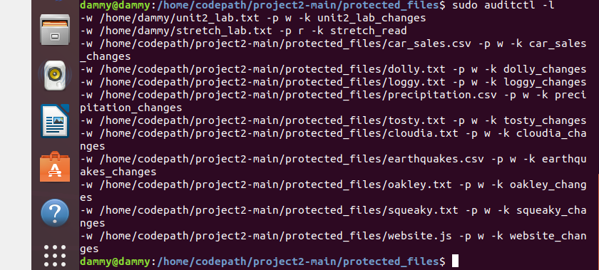
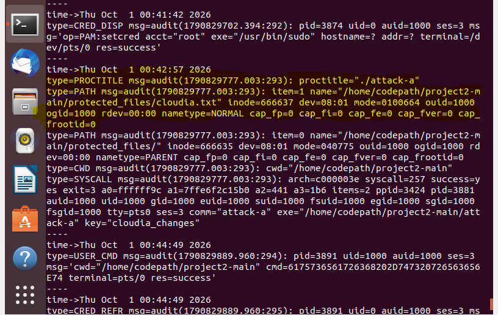
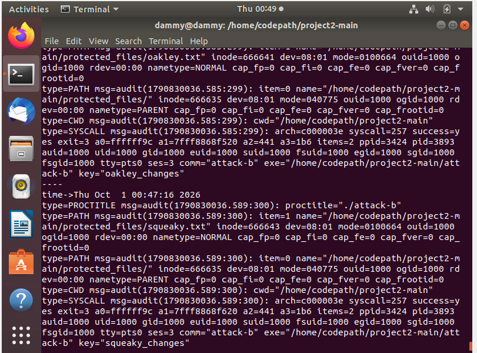
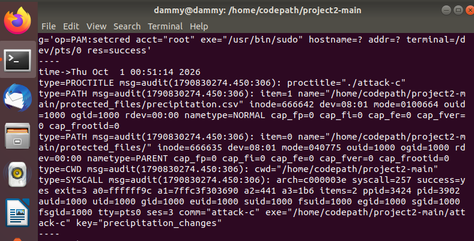

# Linux Auditd Attack Investigation

## Overview

In this project, I used the Linux Audit daemon (`auditd`) to monitor protected files and investigate unauthorized file modifications.

I created audit rules for 10 files, ran three simulated attack scripts, and reviewed the resulting audit logs to determine which files were modified and which attack was responsible for each change.

## Tools Used

- Ubuntu Linux
- `auditd`
- `auditctl`
- `ausearch`
- Linux command line

## Investigation Process

### 1. Configure File Monitoring

I created individual Audit rules to monitor write activity on each file in the `protected_files` directory.

Each rule was assigned a unique filter key so that activity could be identified more easily in the audit logs.

Example:

```bash
sudo auditctl -w /home/codepath/project2-main/protected_files/cloudia.txt -p w -k cloudia_changes
```

I verified that the monitoring rules were active using:

```bash
sudo auditctl -l
```



### 2. Run the Simulated Attacks

Three attack executables were used to modify unknown files:

```bash
./attack-a
./attack-b
./attack-c
```

The scripts did not reveal which files they changed, so I used the audit trail to investigate the activity.

### 3. Analyze the Audit Logs

I searched the audit logs for file paths, filter keys, and the processes responsible for the changes.

```bash
sudo ausearch -ts recent | grep -E 'key=|name='
```

The audit events showed both the affected file and the executable responsible for modifying it.

### Attack A

The audit logs showed that `attack-a` modified `cloudia.txt`.



### Attack B

The audit logs showed that `attack-b` modified both `oakley.txt` and `squeaky.txt`.



### Attack C

The audit logs showed that `attack-c` modified `precipitation.csv`.



## Findings

| Attack | File Modified |
| --- | --- |
| `attack-a` | `cloudia.txt` |
| `attack-b` | `oakley.txt` |
| `attack-b` | `squeaky.txt` |
| `attack-c` | `precipitation.csv` |

### File-Attack Pairings

```text
(cloudia.txt, attack-a)
(oakley.txt, attack-b)
(squeaky.txt, attack-b)
(precipitation.csv, attack-c)
```

## What I Learned

This project helped me understand how file integrity monitoring can be used during incident response to determine what changed on a system and identify the process responsible for the activity.

I also learned how Audit filter keys make it easier to search through system logs and connect individual file changes to specific events.

## Skills Practiced

- Linux system monitoring
- File integrity monitoring
- Audit rule creation
- Audit log analysis
- Incident investigation
- Host-based intrusion detection
- Event filtering
- Attack attribution
